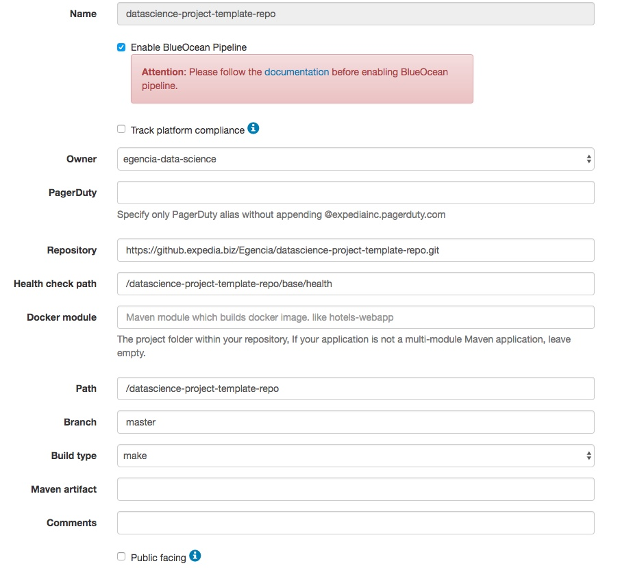
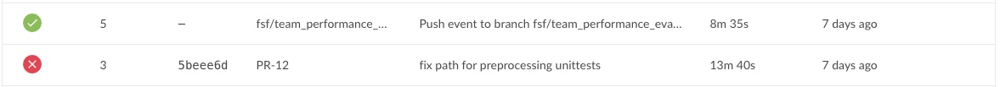
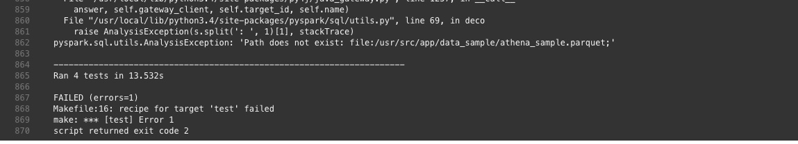
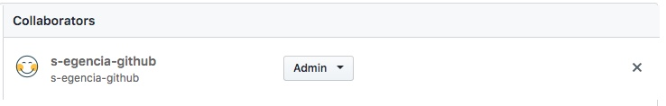

# Unittests

#### How to create a unit test

- Examples and documentation on unittest package can be found here: https://docs.python.org/3/library/unittest.html
- Other examples, from FSF projects: https://github.expedia.biz/Egencia/datascience-projects/tree/master/fare_shrinker_ml/__tests

#### Test discovery within CICD

- The CICD will look up for file using the prefix test_\*.py. Name your file this way.

- In order to be compatible with test discovery, all of the test files must be modules or packages. Do not forget to add __init\__.py files in folders
  

#### What can be unit tested ? 

- Functions and classes: Make some unit tests on few inputs / outputs 

- Pipelines: In order to unit test a whole pipeline, sample of the data can be added on github in folder __sample_data. Do not push more than ~1000 samples on github. 

#### How to set up your unit test pipeline within your github repository (Compulsory)

We are going to hook a Jenkins unit test pipeline with github Pull requests and Pushes actions. 

1. Clone the template repo and all its structure into your newly created repository
2. Create a New Service in https://edge.egencia-tools.net/services with the name and path or your repo:

3. Go to https://github.expedia.biz/Egencia/<you_repo>/settings/hooks and click on "Add webhook"
* Payload URL: https://jenkins-cumulus.egencia-tools.net/github-webhook/ 
* Content type : application/json
* Which events would you like to trigger this webhook? Just the push event
* Tick Active

#### Monitor Unit Tests (Not compulsory)

- Unit tests launched can be monitor on Jenkins:
https://jenkins-cumulus.egencia-tools.net/blue/organizations/jenkins/<you_repo_name>-pipelines/activity

For failed unit test pipelines: click to see open stdout files and investigate where the unit tests have failed.

#### Link Jenkins back to Github (Compulsory)

- Add s-egencia-github profil to repository collaborators. It will allow to merge or block PR when CICD passes or fails.
